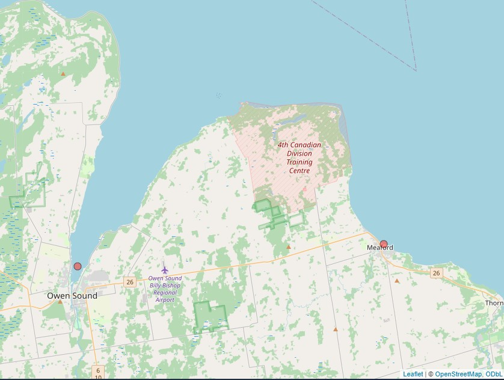
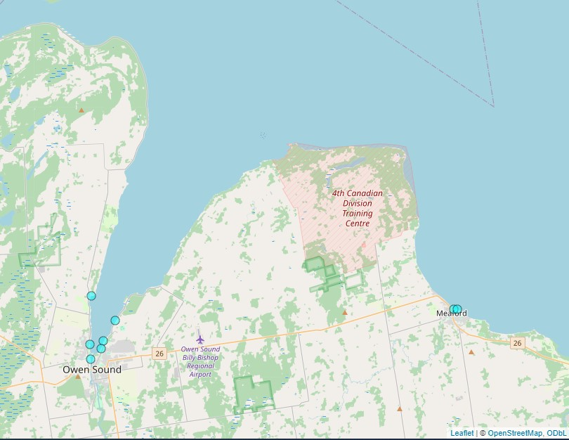
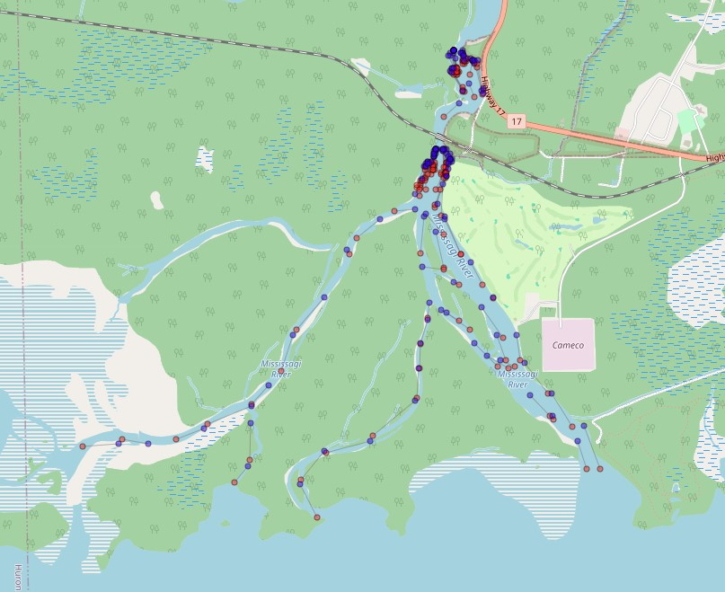
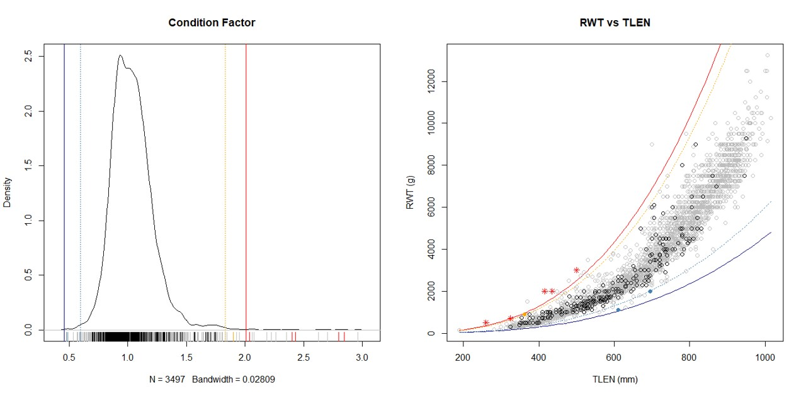
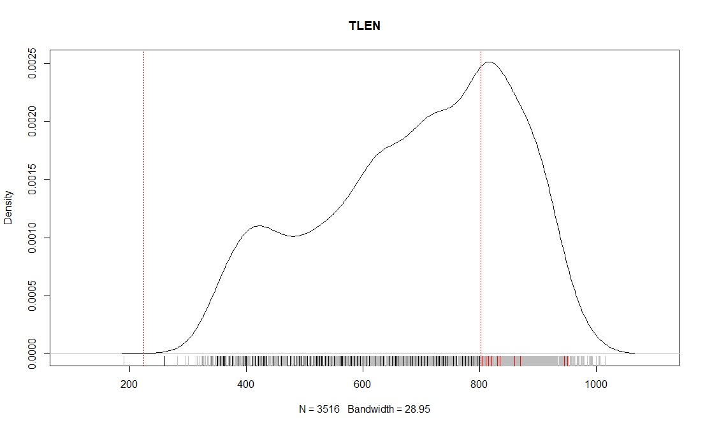
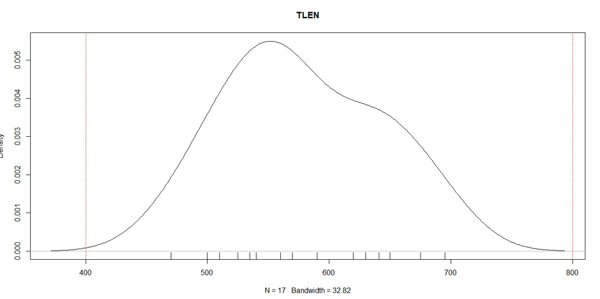

# glisDbTools

The glisDbTools packages is intended to provide some data
manipulation tools for use with GLIS, the glfishr package, and the
upload templates.  Specifically, it provides mappers to the current
GLIS data upload templates for projects in Creesys 4.1 files, and the
Lake Huron Nearshore Master database.  It also includes tools to
compare the contents of tables in two different databases and reports
any differences if any are found.  For the most part, these tools are
intended to facilitate the migration of data from historical data
repositories to GLIS.

NOTE: The functions in glisDbTools currently work with glis upload
templates "Great_Lakes_Sport_Creel_Template_2.accdb" and
"Great_Lakes_Assessment_Template_5.accdb".

## Installation

You can install the development version of glisDbTools like so:

``` r
devtools::install_github("AdamCottrill/glisDbTools")

```

*But most users should probably use the pre-compile binary available on
the GLIS share-point site (it will be of the form:
"glisDbTools_yyyy.mm.dd.zip")*.  If are unable to find a recent
version, contact the package author or one of the Lake Representatives.

## Creesys 4.1 to GLIS Template

The glisDbTools package includes a function that will connect to any
Creesy 4.1 access database and populate a GLIS assessment template
for each of the provided project code(s).


``` r
library(glisDbTools)
## basic example code

# the path to the copy of the creesys master on your computer. The
# name of the file isn't important, but the access file does have to
# match the schema of a Creesys 4.1 database:

src_db <-  "/CREESYS 4.1.accdb"

# the path to an empty copy of GLIS creel upload template:
template_db <- "~/Great_Lakes_Sport_Creel_Template_2.accdb"


# you can pass in a single project code or a vector of project codes:
# prj_cds <-"LHA_SC10_120" # <- this would work too
prj_cds <- c("LHA_SC10_120", "LHA_SC09_120")

# the creesys_to_template function will report its progress and where
# the populated template can found once it is completed.  By default
# it will be located in a ./build folder in the working directory and
# be named with the project codes that were provided, but this can be
# customized:
creesys_to_template(prj_cds, src_db, template_db, overwrite=TRUE)

```


## Nearshore Master to GLIS Template

The glisDbTools package includes a function that will connect to the
Lake Huron Nearshore master (or more likely a copy of it) and populate
a GLIS assessment template for each of the provided project codes.

``` r
library(glisDbTools)
## basic example code

# the path to the copy of the nearshore master on your computer:
src_db <-  "~/IA_NEARSHORE.accdb"
# the path to an empty copy of GLIS assessment template:
template_db <- "~/Great_Lakes_Assessment_Template_5.accdb"

# you can pass in a single project code or a vector of project codes:
# prj_cds <- "LHA_IS10_140"
prj_cds <- c("LHA_IS10_140", "LHA_IS09_140")

# the nearshore_to_template function will report its progress and where
# the populated template can found once it is completed.  By default
# it will be located in a ./build folder in the working directory and
# be named with the project codes that were passed in but this can be
# customized:
nearshore_to_template(prj_cds, src_db, template_db, overwrite=TRUE)


```


## Compare Database Tables

One of the most basic challenges that we will face as we migrate from
historical dataset to GLIS is comparing what exactly is in the
historical dataset with what is in GLIS.  the glisDbTools package
contains some utilities that help with this task.  The primary function
for is compare_tables, which will accept the path to accdb file
populated directly form GLIS, a path to a second accdb file created
from the data in the historical source and the name of the table to
compare. If the tables are exactly the same in both sources, the
function will report "no differences".  If there are differences, a
report will be presented with information about each discrepancy.
The user can then decide if changes need to be made in GLIS, or if the
data in GLIS has already been updated and cleaned.

``` r

library(glisDbTools)

# the complete path a template populated from glis using
# glfishr::populate_template()
glis_db <- "~/LHA_IA22_821_glis.accdb"

# complete path to a template with the data from the same project
# created from the nearshore master (using
# glisDbTools::nearshore_to_template()):
nearshore_db <- "~/LHA_IA22_821_nearshore.accdb"

# we can get a list of tables in each template:
glis_tables <- get_tablenames(glis)
nearshore_tables <- get_tablenames(nearshore)

# By default the list of tables in each database should be exactly the
# same, but will contain extra elements if you have added new tables
# to one or both of the templates.
compare(glis_tables, nearshore_tables)


# the compare_tables() function will compare the structure and
# contents of the provided table in both of the data bases and provide
# a summary of the differences (if any).

compare_tables(glis_db, nearshore_db, "FN011")

compare_tables(glis_db, nearshore_db, "FN121")

compare_tables(glis_db, nearshore_db, "FN127")


```


## Recode PRJ_CD in a Populated Template

Occasionally, a project code needs to change after some or all of the
data has been entered into a template database.  The referential
integrity built into the template database can make this challenging.
the recode_prj_cd() function will automate this task without risk of
corrupting the database or losing any data.


``` r

library(glisDbTools)

# the complete path a populated template database
glis_db <- "~/your_populated_template.accdb"

orig_prj_cd <- "LHA_IA22_821"

new_prj_cd <- "LHA_IA22_128"

# the recoded data will be found in a file name based on the new project code:
recode_prj_cd(glis_db, orig_prj_cd, new_prj_cd)

# we can provide a new file name if we wish:
recode_prj_cd(glis_db, orig_prj_cd, new_prj_cd, "New_recoded_db.accdb")

# by default an error will be thrown if the target database already exists;
# silence that warning and delete the original file using overwrite=TRUE.
recode_prj_cd(glis_db, orig_prj_cd, new_prj_cd, "New_recoded_db.accdb")


```


## Merge Populated Templates

In many instances, it is more efficient to work a single large
template rather than several small ones, the merge_template() function
will take two populated templates and attempt to merge them into a
single accdb file.  The operation will fail if a constraint in the
database is violated (e.g. - duplicate or orphans records).


``` r

library(glisDbTools)

# the complete paths to two populated templates:
glis_db1 <- "~/LHA_IA22_821.accdb"
glis_db2 <- "~/LHA_IA22_821.accdb"

# data from glis_db2 will be instered into glis_db1.  Progress will be
# reported to the console as the operation proceeds:
merge_templates(glis_db1, glis_db2)

```


## Unmerge Template

The unmerge_templates function is the compliment to merge_templates
and will remove all of the data from a template based on the provided
project codes.  By default, a dialoge will ask the user to confirm the
project codes to delete, but this can be suppressed by including
prompt=FALSE when the function is called.


``` r

library(glisDbTools)

# the complete path a populated template:
glis_db <- "~/populated_template_database.accdb"


# remove all of the data from the 2009 and 2010 '*_123' projects:
unmerge_templates(glis_db1, c('LHA_IA09_123','LHA_IA10_123'))

# turn of the confirmation message:
unmerge_templates(glis_db1, c('LHA_IA09_123','LHA_IA10_123'), FALSE)

```


## Plot Spatial Data

The GLIS template contains spatail inforamtion in several different
places - the FN026 and FN026_Subspace tables have fields for latitude
and longitude that represent the centroid of the space and subspace
strata, the FN121\_GPS\_Tracks contains coordinates that represent
trasects collected during electrofishing or trawling transects.
Finally and the FN121 table contains DD\_LAT0-DD\_LON0 and optionally
DD\_LAT1-DD\_LON1 to capture the start and end of a sampling event.
The function ~map_table_points()~ can be used to quickly create
interactive leaflet maps of the spatial data in each of these tables.
Right clicking on any point will render a pop-up containing the slug
of the associated object so it can be quickly and easily found in the source database.


``` r

library(glisDbTools)

# the complete path a populated template database:
glis_db <- "~/populated_template_database.accdb"

# map of the spaces with a larger symbol:
map_table_points(db1, "FN026", radius=4)

# map of the subspaces in a project, using a different fill colour and larger symbol
map_table_points(db1, "FN026_Subspace", fill0='cyan', radius=4)

# each record in the fn121 table can have two points, if so, they will
# be presented as a dumbell two points connected by a line:
map_table_points(db1, "FN121")


```





## Plot FN125 BioData against FN012 Constraints

Process-Validate (the application that ensures consistent of data in
the template), has a number of queries that check the reported
biological data in the FN125 table against the contains specified for
the species and group code.  the procval_plots function can be used to
visualize that data to help identify where there are problems.


``` r

library(glisDbTools)

# the complete path a populated template database:
glis_db <- "~/populated_template_database.accdb"

# Ktlen and Kflen produce a two panel plot show density of condition
# factor and length vs weight:
procval_plot(db, "075", what = "Ktlen", glis_fish = glis_fish)


# if what=TLEN,FLEN or RWT, a single panel density plot will be produced
procval_plot(db, "075", what = "TLEN", glis_fish = glis_fish)

# glis_fish is a dataframe with additional biological data that help
# provide context and appear in the background of the plot. It is
# optional, and may not be needed if a large number of data points
# where collected in your project:
procval_plot(db, "075", what = "TLEN")

```








## Future Functionality:

+ offshore_to_template - populate a template database from the Lake
  Huron Offshore Master for the specified project code(s).  Other data
  sources could be added in the future as needed (eg. - fishnet
  archive, Lake Superior FCIN master ect.)


+ prune_prj_cds - delete all of the records from the target database
  for the specified project code(s)

+ clone_design_tables - often users want to be able to repeat a past
  project and need to get the FN0* tables in a new template database
  with a new project code.  This could be accomplished by creating a
  function that takes an old project code, and a new project code and
  then populates the data from GLIS, or it could take a populated
  template database (with a single project code) and prune all of the
  records from the FN121 down, and recode the project code for the
  remaining table. There would probably be a valid use case for both
  approaches (the first could be emulated by downloading all of the
  data for the source project using populate_template() and then
  pruning that.)


+ migrate() - update a template from version X to Y
